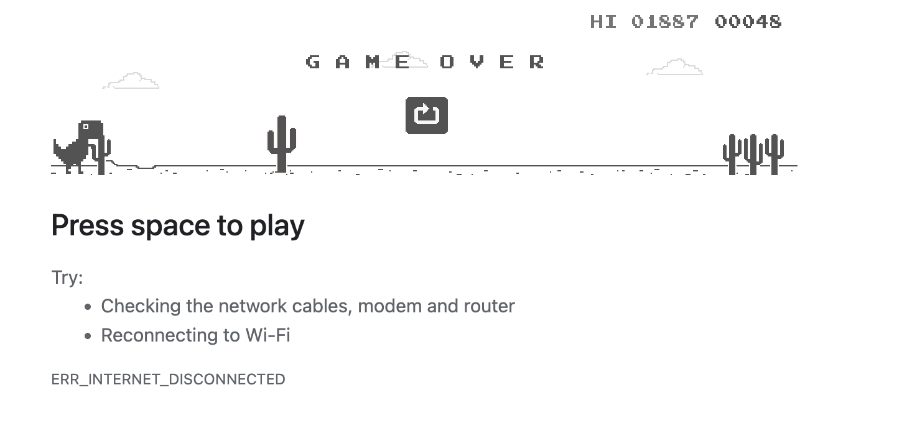

# Dino game in Python Processing

Dit is een kleine Dino game, een variant van de bekende Chrome game..

## Speluitleg

In deze game bestuur je een dino die automatisch naar rechts loopt. Je doel is om over cactussen te springen die op je pad verschijnen. De game is geïnspireerd op de bekende Chrome offline dino game.

### Besturing

- Springen: druk op de spatiebalk om te springen.

### Afbeeldingen

- De dino wordt getekend met een afbeelding (`dino-image/dino.png`).
- Obstakels zijn cactussen, afwisselend getoond met `cacti.png` en `3cacti.png`.

### Gameplay

- De dino beweegt niet horizontaal, maar springt omhoog als je op spatie drukt.
- Cactussen bewegen van rechts naar links over het scherm.
- Als de dino een cactus raakt, is het game over.
- Je score wordt verhoogd elke keer dat je een cactus ontwijkt.

### Collision systeem

Er wordt gecontroleerd of de dino en een cactus elkaar overlappen. Als dat gebeurt, stopt het spel en verschijnt "Game Over!" in beeld.

*Figuur 1*: Botsing

## Speler en obstakels/tegenstanders

Er komen ... Dit zijn ook afbeeldingen.... We delen deze in

### Spelkarakter: Dino

### NPC's: Cactus en 3 cacti

## TODO: Birds, oplopende moeilijkheidsgraad en (high)score

Vogels nog toevoegen, die op een gegeven moment ook verschijnen waar de dino onder door moet bukken.

We moeten ook moeilijkheidsgraad instellen. Er zijn geen discrete levels, maar de game voert de moeilijkheid heel geleidelijk op, doordat de game steeds iets sneller scrollt (Dino lijkt harder te gaan lopen), en er verschijnen meer vijanden en met iets meer varieteit. Het moet wel altijd 'springbaar/duikbaar' blijven, dus nooit zoveel obstakels achter elkaar dat de dino er niet overheen kan springen.

Ook moet de score langzaam oplopen, bv per gepasseerd obstakel, en de game moet de highscore tot nu toe bijhouden.

## Wanna have/Won't have

Je zou bijvoorbeeld ook met andere karakters dan een dino kunnen spelen, zoals Mario, oh nee, trademark, eh bv. een cowboy in de woestijn of een roadrunner. De roadrunner kan bv. ook zelf sneller gaan rennen en heeft nog een coyote die af en toe achter hem verschijnt als hij te langzaam gaat. En de cowboy can bijvoorbeeld als level op een paard pakken onderweg en daarmee hoger springen.
