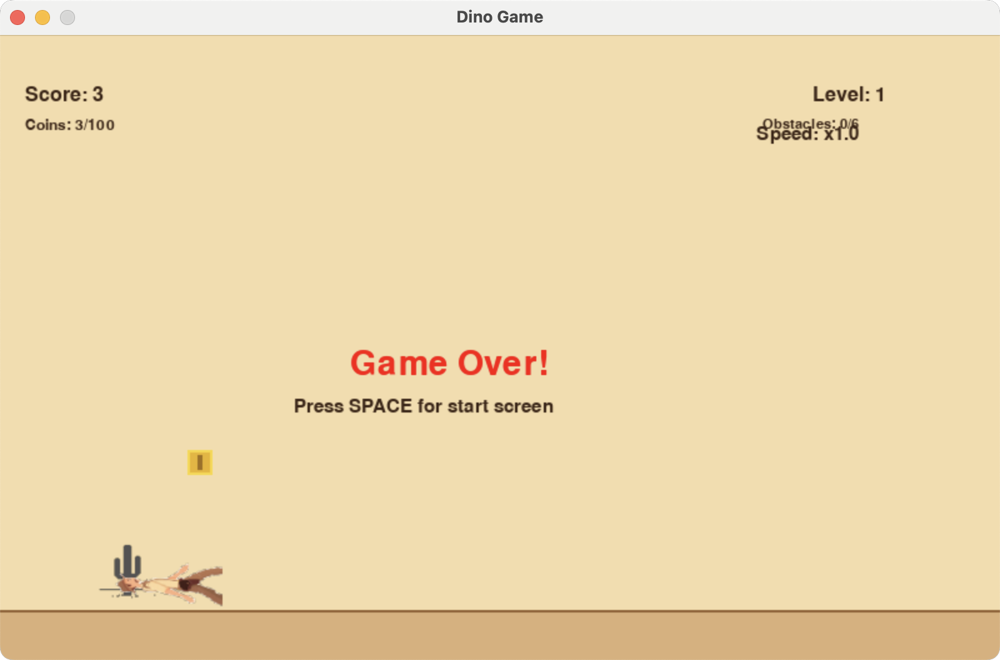
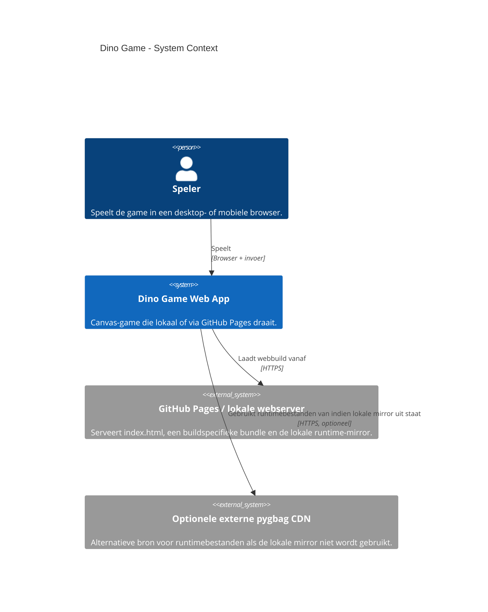
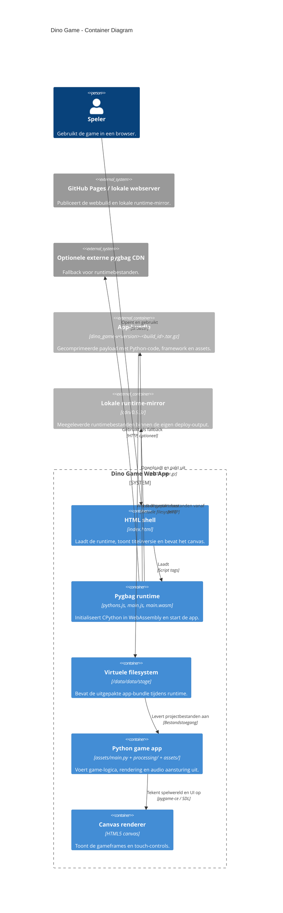
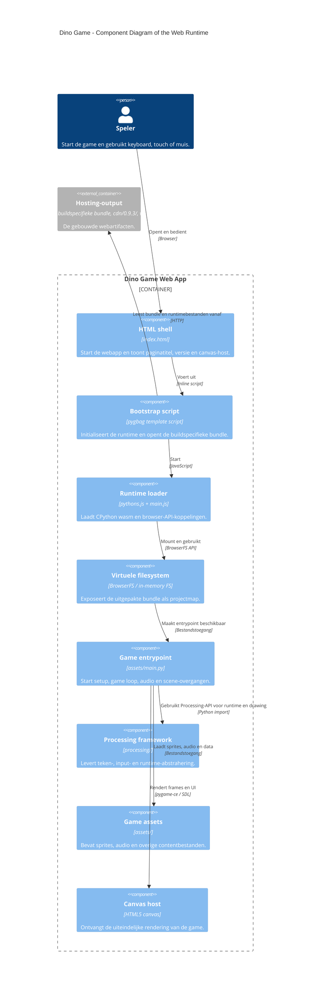

# Software Guidebook

Voor de hoofdstukindeling volgen we vooral de Software Guidebook-benadering van Simon Brown. Waar een lokale onderwijsvertaling helpt, sluiten we ook aan op de structuur van AIM/ENE.

- Context
- Functional Overview
- Quality Attributes
- Constraints
- Principles
- Software Architecture
- Code
- Data
- Infrastructure Architecture
- Deployment
- Operation and Support
- Development Environment
- Decision Log

Deze guidebook gebruikt ook een vaste schrijfstijl. De regels hieronder houden de tekst technisch, precies en consistent.

- Technische documentatie hoort helder en ondubbelzinnig te zijn.
- Vermijd onnodige bijvoeglijke naamwoorden en bijwoorden, omdat die technische tekst vaak subjectiever en minder precies maken.
- Bad practice quote: "adjectives and adverbs sometimes make technical readers bark loudly and ferociously." Source: [Google Technical Writing, Clear Sentences](https://developers.google.com/tech-writing/one/clear-sentences#minimize_certain_adjectives_and_adverbs_optional)

## 1. Context

Deze guidebook beschrijft hoe de Dino Game functioneel, technisch en operationeel in elkaar zit.

Gebruik dit bestand als referentie voor:

- levelprogressie;
- powerups en shopgedrag;
- boss-entrances en speciale arena's;
- UI-, audio- en feedbackprincipes;
- runtime-, build- en deploygedrag.

## 2. Functional Overview

De game is een level-based runner met characterkeuze, powerups, mini-bosses, flight-secties en een finale met credits.

- De speler doorloopt ontworpen levels met leerbare obstaclepatronen.
- De shop en powerups geven tijdelijke boosts of bescherming, maar veranderen de basisregels niet.
- Boss fights en flight mode zijn expliciete spelmodes met eigen presentatie, pacing en audio.
- Verdere functionele details staan later in dit document onder powerups, bosses en levels.

### 2.1 Shop En Powerups

De badger shop verschijnt in het menu en vlak voor boss fights.

### 2.1.1 Beschikbare powerups

- `Extra Life`:
  - icoon: hartje;
  - effect: absorbeert één fatale hit;
  - gebruik: blijft als voorraad bewaard tot een botsing het item verbruikt.
- `Shield`:
  - icoon: schild;
  - effect: tijdelijke bescherming;
  - duur: `SHOP_SHIELD_MS = 5000`.
- `Coin Boost`:
  - icoon: muntjes `x2`;
  - effect: verdubbelt verzamelde coins tijdelijk;
  - duur: `SHOP_COIN_BOOST_MS = 60000`.
- `Jump Shoes`:
  - icoon: schoenen;
  - effect: hogere sprongen tijdelijk;
  - duur: `SHOP_JUMP_SHOES_MS = 30000`.

### 2.1.2 Activatiegedrag

- Aankopen in het startmenu worden bij run-start geactiveerd.
- Aankopen in de pre-boss shop worden geactiveerd zodra de speler de shop-overlay afsluit.
- Het schild en extra leven zijn verdedigende lagen; coin boost en jump shoes zijn tijdelijke boosts.

### 2.1.3 UI-richting

- De vier shop-items horen icon-first te zijn.
- Dezelfde iconen mogen later ook in de HUD gebruikt worden zodra losse uitgesneden assets beschikbaar zijn.
- De huidige HUD mag daarom iconen naast tekst tonen in plaats van alleen tekstregels.

### 2.2 Boss Entrances

Voor elk boss level stopt de endless-runner-flow kort in een statische hubscene.

- De speler kan daar links/rechts bewegen zoals in een boss arena.
- Links staat de badger shop.
- Rechts staat de entrance naar het gevecht.
- Interactie gebeurt met `Pijl omlaag`.

### 2.2.1 Mini bosses

- Voor level 4 en level 7 staat rechts een arena-ingang.
- De speler kan eerst shoppen en daarna bewust het gevecht starten.
- Tussen level 5 en level 6 zit een afwijkende minibossflow: aan het einde van de pipe/flappy flight-sectie verschijnt een Zeppelin in de lucht in plaats van een ground-hub.
- Die Zeppelin wordt verslagen vanuit het eigen gele vliegtuig met een schot-aanval; de boss is dus onderdeel van `flight_mode` en niet van de gewone boss hub.

### 2.2.2 Zeppelin miniboss gedrag

- De Zeppelin komt eerst de stad in tijdens een korte `approach`-fase; daarna start pas de echte fight-fase.
- Tijdens deze encounter blijft de speler in `flight_mode`; er is dus geen ground reset of gewone boss hub tussen intro en gevecht.
- De Zeppelin gebruikt een sprite-based render zodra `assets/zeppelin.png` beschikbaar is; alleen zonder asset blijft de oudere procedurale fallback actief.
- Tijdens het gevecht kan het vliegtuig `3` treffers van zeppelin-projectiles opvangen voordat het neerstort.
- Zodra de Zeppelin verslagen is, blijft `flight_mode` actief en loopt de speler direct door naar level 6 in plaats van eerst terug naar een ground-scene te vallen.
- Na de eerste treffer rookt het vliegtuig periodiek ongeveer elke `4` seconden.
- Na de tweede treffer rookt het vliegtuig periodiek ongeveer elke `2` seconden.
- De derde treffer door een zeppelin-projectile veroorzaakt een crash.
- Een botsing met een pipe blijft direct fataal; pipe-collisions gebruiken dus geen hitpoint-systeem.
- De post-boss overgang mag de luchtarena pas loslaten nadat de defeat/explosion sequence visueel klaar is.
- Pas daarna schakelt de game terug van city-bossarena naar de cave-flight presentatie van level 6.

Waarom:

- De overgang van level 5 naar 6 bouwt al een luchtmechanic op; een luchtboss benut die bestaande skill direct.
- Een ground-hub zou de opgebouwde flight-spanning onnodig onderbreken.
- De speler moet dezelfde besturing en voertuigfantasie behouden tijdens het gevecht.
- Een 3-hit vliegtuigstate maakt de fight minder binair en leesbaarder zonder pipes of arena-positioning ongevaarlijk te maken.
- Rookfeedback maakt schade zichtbaar in de wereld zelf, in lijn met het principe dat gameplay-impact niet alleen in tekst mag zitten.

### 2.2.3 Eindbaas level 10

- Voor de coyote-boss staat rechts een pijp.
- `Pijl omlaag` op de pijp start de ondergrondse boss arena.
- De arena gebruikt een donkerdere, grijze grot-achtige achtergrond.
- Grote vallende bommen tonen een gele landingsgloed zolang ze nog in de lucht zijn.
- Zodra een grote bom ontploft, licht de cave kort op.

### 2.2.4 Documentatiegraad bosses

- De globale boss-entrances en de specifieke level-5/6 en level-10 regels zijn nu beschreven in deze SGB.
- Het volledige encountergedrag van de bird boss, cactus boss en final boss is nog niet overal systematisch uitgeschreven.
- Verdere iteraties op boss-balans, arena-flow en visuele feedback horen die encounterregels later ook expliciet per boss aan te vullen.

### 2.3 Level Systeem

- De game heeft `10` levels.
- Hoofdstuk `1` duurt `6` obstacles.
- Elk volgend level vraagt `3` obstacles meer dan het vorige.
- Bij elk nieuw level stijgt de scrollsnelheid met factor `1.1`.
- Score en level-progressie zijn losgekoppeld:
  - score komt uit punten, coins en boss rewards;
  - level-progressie komt uit het aantal cleared obstacles.
- Boss rewards volgen de benodigde hits:
  - miniboss `1`: `15` punten;
  - miniboss `flight Zeppelin`: `18` punten;
  - miniboss `2`: `15` punten;
  - eindbaas: `35` punten.

### 2.3.1 Obstakelgeneratiebeleid

- Levels `1` t/m `7` zijn primair leerbaar en gebruiken vaste obstaclepatronen.
- Vanaf level `8` is beperkte variatie toegestaan, maar alleen met curated templates (geen vrije RNG-combinatie van losse obstakels).
- Elke template voor level `8+` moet handmatig speelbaar gevalideerd zijn.
- Validatieregel: ook als een high-jump powerup leeg is, moet de speler met normale sprong een uitwijkroute of haalbare timing houden.
- Templates die directe "soft-lock" situaties kunnen veroorzaken (zoals te krappe multi-cactusketens zonder herstelmoment) zijn niet toegestaan.

### 2.3.2 Aantal obstacles per level

- Level `1`: `6` obstacles.
- Level `2`: `9` obstacles (`15` totaal).
- Level `3`: `12` obstacles (`27` totaal).
- Level `4`: `15` obstacles (`42` totaal).
- Level `5`: `18` obstacles (`60` totaal).
- Level `6`: `21` obstacles (`81` totaal).
- Level `7`: `24` obstacles (`105` totaal).
- Level `8`: `27` obstacles (`132` totaal).
- Level `9`: `30` obstacles (`162` totaal).
- Level `10`: `33` obstacles (`195` totaal).

### 2.4 Levels

### 2.4.1 Level 1: `Enter Cactus Land...`

- Introductie van de woestijn.
- Basisobstakels: lage cactus, hoge cactus en lage vogel.
- Nog geen slang.

### 2.4.2 Level 2: `Snake Sands`

- Meer druk in de woestijn.
- Slangen komen erbij.
- Timing tussen vogel, cactus en slang varieert meer.

### 2.4.3 Level 3: `High Jump Ridge`

- Verticale sprongen worden belangrijker.
- Torencactus en high-jumpflow krijgen nadruk.
- Jump blocks kunnen regen, natte grond en bloemen triggeren.

### 2.4.4 Level 4: `Bird Boss Canyon`

- Eerste minibossfase.
- Reuzenvogel-boss.
- Shop-hub vóór de arena-ingang.

### 2.4.5 Level 5: `Fly away`

- Eerste vliegtuighoofdstuk.
- Pijpen verschijnen als obstakels.
- Vliegtuig kan als pickup flight mode starten.
- Tijdens de flight-sectie vliegen er ook vogels tussen de pijpen door.
- Die vogels kiezen bewust een route net boven de onderpijp of net onder de bovenpijp, zodat ze zelf niet tegen de pijpen botsen.
- Tegen het einde van level 5 verschijnt een dubbele vogelpassage met tegelijk een bovenste en onderste vogel, zodat alleen de middellijn veilig blijft.
- Aan het einde van dit level verschijnt de Zeppelin-tussenbaas als luchtgevecht boven de stad.
- De speler blijft in het gele vliegtuig en schiet de Zeppelin neer voordat level 6 begint.

### 2.4.6 Level 6: `Blue Caverns`

- Tweede vliegtuighoofdstuk.
- Flight mode loopt direct door vanuit de zeppelin-fight aan het einde van level 5.
- De groene pijpen maken plaats voor blauwe cave hazards die als stalactieten en stalagmieten uit plafond en vloer groeien.
- Deze hazards bewegen langzaam op en neer door het gat tussen boven- en onderzijde te verschuiven.
- Een deel van de hazards begint kort te trillen voordat een stuk steen losbreekt en naar beneden valt.
- Dit level gebruikt geen aparte miniboss-intro meer; het is juist de doorlopende cave-flight nasleep van de zeppelin-boundary fight.

### 2.4.7 Level 7: `Cactus Fortress`

- Tweede minibossfase.
- Grondgevecht tegen de reuzencactus.
- Shop-hub vóór de arena-ingang.

### 2.4.8 Level 8: `Wild Flats`

- Meer tempo en krappe obstacle-combinaties.
- Multi-cactus packs vragen snelle landingen.

### 2.4.9 Level 9: `Bird Storm`

- Voorbereiding op de eindbaas.
- Hogere reactiedruk en minder hersteltijd.
- Vogelzwermen doorbreken hier de oude enkelvoudige obstakelcadans.

### 2.4.10 Level 10: `Giant Town`

- Eindbaasfase.
- Reuzenvariant per karakter:
  - dino: `ReuzenDino`;
  - cowboy: `ReuzenCowboy`;
  - roadrunner: `ReuzenCoyote`.
- Voor de coyote-route loopt de speler eerst via de shop-hub naar een pijp.
- De coyote wordt verslagen door `5` grote bommen terug te gooien.

## 3. Quality Attributes

Elk principe en elke structurele beslissing in dit document bevat expliciet een `Waarom`.

- Zonder rationale zijn regels lastig te toetsen en verouderen ze sneller.
- Met rationale kunnen we wijzigingen evalueren op intentie, niet alleen op letterlijke tekst.

### 3.1 Exception Visibility

Exceptions worden niet stil ingeslikt.

Waarom:

- Een fout zonder logregel is in praktijk nauwelijks te debuggen, zeker in de web-runtime.
- Stil ingeslikte exceptions maken regressies onzichtbaar en laten kapot gedrag doorgaan alsof het "gewoon niet ondersteund" is.
- Browser-, audio- en assetproblemen moeten direct herleidbaar zijn naar de callsite en het bestand dat faalt.

- Geen `except Exception: pass` in projectcode.
- Als een exception bewust wordt opgevangen om runtime of tooling overeind te houden, log dan minimaal context, exceptiontype en melding naar console of stderr.
- Bij herhaalbare runtimefouten mag logging gededupliceerd worden om spam te beperken, maar de eerste fout moet zichtbaar blijven.

### 3.2 Platform Parity (DEV/PROD)

Lokaal draaien en web-deploy moeten dezelfde game opleveren qua gedrag.

Waarom:

- We willen lokaal snel itereren in Python-modus, zonder dat gedrag later op web functioneel afwijkt.
- Dat voorkomt verrassingen bij release: wat lokaal speelbaar en correct is, moet online dezelfde mechanics tonen.
- Performance kan tussen runtime-omgevingen verschillen; daarom testen we naast lokaal ook regelmatig de web-build zelf.

- Geen platform-specifieke gameplayregels: obstaclelogica, powerups, hitboxes, timing en scoreprogressie zijn identiek op desktop en web.
- Geen content-splitsing per platform: levels, patterns en balanswaarden worden centraal beheerd en niet gedupliceerd in `if IS_WEB` versus lokaal.
- Platform-afhankelijke code mag alleen voor technische runtime-zaken (bijv. input/audio unlock, packaging, pad-resolutie), nooit voor gamebalans of mechanics.
- Performanceproblemen worden opgelost met generieke optimalisaties die overal gelden (assets, renderpad, objectbeheer), niet met afwijkende spelregels op web.

## 4. Constraints

### 4.1 Framework Boundary

De map `processing/` is frameworkcode en heeft een andere wijzigingsdrempel dan gamecode zoals `dino_game.py`.

Waarom:

- Een wijziging in `processing/` heeft een veel grotere blast radius dan een wijziging in één sketch.
- Frameworkwijzigingen veranderen impliciet het contract voor alle sketches en moeten daarom als library-werk behandeld worden, niet als lokale bugfix.
- Als een bug alleen in één game of sketch zichtbaar is, lossen we die standaard eerst in de appcode op. Alleen bij bewezen frameworkschuld en expliciete afstemming passen we `processing/` aan.

- Geen ad-hoc wijzigingen in `processing/` om een bug in één sketch te fixen.
- Eerst het owning codepad in de app zelf onderzoeken.
- Als een frameworkaanpassing toch nodig lijkt, eerst expliciet afstemmen en idealiter apart behandelen als library-bug of library-change.

## 5. Principles

In dit hoofdstuk staan de ontwerpprincipes die richting geven aan gameplay, visuele consistentie, foutgedrag en audiofeedback.

### 5.1 Creative Integrity

De game gebruikt dezelfde visuele taal op meerdere plekken.

- Sprite-based visualisation (`.png`) heeft de voorkeur boven ad-hoc getekende placeholders zodra een asset beschikbaar is.
- Interactieve keuzes gebruiken kleine, duidelijke kaders met een subtiele pulse of glow.
- Shop-items mogen dus niet ineens als totaal andere UI-componenten verschijnen als ze al als iconen in HUD of shop bestaan.
- Informatie met gameplay-impact moet leesbaar zijn in de wereld zelf, niet alleen als tekst erboven.
- Gevaar krijgt altijd een visuele cue: bijvoorbeeld een landingsgloed onder een vallende bom, of een arena die oplicht bij explosies.
- Level-flow is leerbaar: obstaclevolgordes zijn in basis scripted/hardcoded per level, zodat spelers patronen kunnen herkennen en verbeteren.
- Variatie mag alleen gecontroleerd: vanaf hogere levels uitsluitend via een kleine, vooraf ontworpen set veilige patroonblokken.
- Onmogelijke combinaties zijn verboden: runtime mag geen obstacleketens genereren die niet haalbaar zijn met normale timing/spronghoogte wanneer een powerup net is afgelopen.
- Luchtlevels gebruiken decoratieve parallax-wolken als sfeerlaag en leesbare snelheidsreferentie, nooit als obstacle of misleidende hitbox.
- Menu-tekst boven de luchtlaag gebruikt karakter-afhankelijke contrastkleuren en mag nooit visueel over elkaar heen vallen; titel, startprompt en character-select copy blijven gescheiden blokken.
- Een echte sprite-asset vervangt procedurale placeholder-tekeningen zodra zo'n asset beschikbaar en geschikt is.

### 5.2 Semi-Realistische Continuiteit

Interacties mogen gestileerd zijn, maar de wereld mag niet abrupt vergeten wat er net nog zichtbaar of fysiek aanwezig was.

Waarom:

- De game is arcadeachtig, maar voelt sterker als objecten en gevolgen logisch doorlopen in beeld.
- Een vliegtuigcrash die direct omslaat naar een grond-lijk zonder wrak of luchtobstakels breekt de ruimtelijke continuiteit.
- Semi-realistische consequentie maakt verlies, impact en level-geometrie leesbaarder zonder dat de game een simulator hoeft te worden.

- Bestaande wereldobjecten verdwijnen niet zomaar op het moment van impact als daar geen zichtbare reden voor is.
- Een crash in `flight_mode` hoort visueel eerst als vliegtuigcrash leesbaar te blijven voordat de game reset of naar een andere state springt.
- Obstakels en arena-elementen blijven in principe zichtbaar tijdens een defeat-state als zij direct onderdeel waren van de aanleiding van die defeat.
- Stylization is toegestaan, maar alleen zolang oorzaak en gevolg voor de speler visueel navolgbaar blijven.

### 5.2.1 Character Asset Contract

Voor character poses is een runtime sprite sheet niet verplicht, maar de assetset moet zich wel gedragen alsof de frames uit één sprite sheet komen.

Begrippen:

- `canvas`: de volledige rechthoek van een spritebestand, inclusief transparante marge.
- `crop`: hoe strak het zichtbare figuur uit een groter beeld is uitgesneden.
- `grondlijn`: de denkbeeldige horizontale lijn waarop voeten, poten of wielen de grond raken.
- `anchor`: het vaste referentiepunt waarmee een pose op dezelfde plek wordt getekend als de vorige pose.

Waarom:

- Het grootste risico bij losse PNG's is niet het ontbreken van een sheet, maar inconsistente canvasmaat, baseline en anchor tussen poses.
- Een crouch-pose die strakker of anders gecropt is dan de normale pose veroorzaakt zichtbaar verspringen tijdens posewissels, ook als de hitbox zelf correct blijft.
- Een sprite sheet maakt zulke afwijkingen snel zichtbaar, maar dezelfde discipline is ook mogelijk met losse bestanden.

- Losse PNG's per state zijn toegestaan; een sprite sheet is dus geen vereiste.
- Binnen één character-set moeten alle poses exact dezelfde canvasbreedte en canvashoogte hebben: dus echt dezelfde pixelmaat per bestand binnen die set.
- Binnen één character-set delen alle poses dezelfde grondlijn: voeten of laagste contactpunt landen op dezelfde horizontale lijn.
- Binnen één character-set delen alle poses dezelfde horizontale anchor, zodat een posewissel niet naar links of rechts "springt".
- Strakke crops zijn ondergeschikt aan consistentie: voeg liever transparante marge toe dan dat één pose kleiner of verschoven binnenkomt.
- De concrete pixelmaat hoeft niet vooraf globaal voor alle characters gelijk te zijn, maar wordt per character-set expliciet gekozen zodra de eerste definitieve asset van die set wordt ingevoerd.
- Zodra zo'n maat voor een character-set is gekozen, worden nieuwe poses in die set daarop gepad of uitgelijnd in plaats van opnieuw vrij gecropt.

Foutvoorbeelden:

- `normaal` is 220 x 160 pixels, maar `duck` is 184 x 109 pixels. Resultaat: de sprite lijkt kleiner te worden en verschuift bij het bukken.
- `normaal` heeft 18 pixels transparante ruimte onder de voeten, maar `duck` maar 2 pixels. Resultaat: de crouch-variant zakt visueel door de grond of schiet omhoog.
- `normaal` is gecentreerd op het midden van het canvas, maar `duck` is verder naar links gecropt. Resultaat: de pose "teleporteert" horizontaal tijdens het wisselen.
- `oops` is veel strakker uitgesneden dan `normaal`. Resultaat: dezelfde character voelt ineens alsof die van schaal verandert.

Goed voorbeeld:

- Als de dino-set eenmaal op een vaste pixelmaat is gezet, moeten `normaal`, `duck`, `oops` en eventuele extra poses allemaal precies diezelfde canvasmaat, grondlijn en anchor gebruiken, ook als de zichtbare dino in de crouch-versie lager of compacter is.

Repo-voorbeelden:

- Losse sprite: `assets/dino-transparant.png`
- Sprite sheet: `assets/plane-sprite.png`

Waarom:

- De Chrome Dino-vluchtstukken voelen sterker als luchtspace wanneer de achtergrond subtiel meebeweegt.
- Parallax helpt snelheid en diepte lezen zonder extra gameplay-ruis toe te voegen.
- Wolken mogen de obstacleleesbaarheid niet aantasten; daarom blijven ze puur decoratief.
- Ook in het menu moet tekst boven de lucht onmiddellijk leesbaar blijven; gekozen karakter en luchtkleur bepalen dus mee welke donkere contrastkleur daar werkt.

### 5.3 Geen Defensieve Gameplay-Fallbacks

Gameplaycode mag niet stilletjes ander gedrag kiezen als een asset, API, state of aanname ontbreekt.

Waarom:

- Fallbacks maken fouten onzichtbaar en daardoor lastig te reproduceren.
- Testen wordt onbetrouwbaar als code onder onbekende omstandigheden "iets anders" doet dan het ontworpen gedrag.
- Bij AI-assisted development moeten ontbrekende assets, ontbrekende API's en kapotte aannames expliciet zichtbaar worden, anders bouwt de agent verder op een verborgen fout.
- Een hard failure met een duidelijke oorzaak is beter dan een speelbare maar verkeerde toestand.

- Geen stille fallback van ontbrekende gameplay-assets naar oude sprites.
- Geen alternatieve mechanics bij ontbrekende functies of ongeldige state.
- Geen brede `try/except` rond gameplaylogica om fouten te maskeren.
- Wel toegestaan: expliciete platform-adapters voor technische runtimeverschillen, mits gameplaygedrag gelijk blijft en fouten zichtbaar blijven.

### 5.4 Audio Feedback

Sprong-audio moet het type sprong duidelijk maken.

Waarom:

- Een high jump moet niet alleen visueel waarneembaar zijn, maar zowel visueel als auditief.
- Het `weeh`-geluid past bij dat high-jump moment en maakt het effect direct herkenbaar.
- Dit ondersteunt timingleren, vooral bij snelle obstacle-combinaties.
- Waar een file-backed SFX webproblemen geeft, mag een runtime-generated sound als technische fallback bestaan, zolang de functionele betekenis van de sprong helder blijft.

- Normale sprong: gebruik `jump.wav` voor alle karakters.
- Versterkte/high jump (duck-jump, high-jump powerup of actieve jump shoes): gebruik `weeh.wav` voor alle karakters.

## 6. Software Architecture

### 6.1 Web Runtime en Packaging

De webbuild bestaat niet uit "los wat Python-bestanden in de browser draaien", maar uit een kleine bootstraplaag plus een gecomprimeerde app-bundle.

Waarom:

- Zonder dit mentale model is het lastig te begrijpen waarom lokaal en productie kunnen verschillen terwijl de broncode zelf gelijk lijkt.
- De browser voert de app niet rechtstreeks uit de repository uit, maar uit een opgebouwde en verpakte webbundle.
- Voor debugging van webdeploys moet duidelijk zijn welk deel runtime is, welk deel appcode is, en welk deel uit lokale mirror of externe CDN komt.

#### 6.1.1 Wat is de webbundle precies?

- Tijdens de build wordt eerst een tijdelijke stage-map opgebouwd in `.web-build/stage/`.
- Daarin worden de app-entrypoint (`main.py`), `processing/`, `assets/` en enkele begeleidende bestanden gekopieerd.
- Pygbag produceert vervolgens weboutput met `index.html` plus een gecomprimeerde app-bundle.
- In dit project wordt die gedeployde bundle na de build hernoemd naar een buildspecifieke bestandsnaam zoals `dino_game-v0.2.0-<build_id>.tar.gz`.
- De bootstrapcode in `index.html` haalt precies die buildspecifieke bundle op en pakt die uit in de virtuele filesystem van de wasm-runtime.
- De Python-code van de game zit dus inderdaad in die gedeployde bundle, samen met assets en frameworkbestanden.
- De CPython WebAssembly-runtime zelf zit daar niet in; die komt uit de pygbag-runtimebestanden zoals `pythons.js`, `main.js` en `main.wasm`.

#### 6.1.2 Wat betekent `bundle = "stage"` dan?

- In `scripts/web/default.tmpl` staat een Python-variabele `bundle = "stage"`.
- Dat is geen environmentvariabele en ook geen verwijzing naar productie.
- Die naam wordt alleen intern gebruikt als runtime-mountnaam voor het virtuele pad `/data/data/stage`.
- De mountnaam `stage` en de bestandsnaam van de gedeployde bundle zijn dus twee verschillende dingen.
- De live gedeployde productiebundle kan bijvoorbeeld `dino_game-v0.2.0-<build_id>.tar.gz` heten, terwijl die na uitpakken nog steeds onder `/data/data/stage` beschikbaar komt.

#### 6.1.3 Waarom bestaat die tarball überhaupt?

- De browser kan niet direct een hele Python-projectmap als lokale directory mounten.
- Een gecomprimeerde bundle maakt het mogelijk om de volledige app als één payload te downloaden en daarna in de virtuele wasm-filesystem uit te pakken.
- Daardoor kan `assets/main.py` in de browser draaien alsof het een gewone projectmap is.
- Het verschil tussen lokale preview en productie zit daardoor vaak niet in "de repo", maar in welke gegenereerde webbundle daadwerkelijk wordt geserveerd.

#### 6.1.4 Lokaal previewen versus productie

- `http://127.0.0.1:9000/` serveert de lokale gegenereerde webbundle uit `.web-build/output/`.
- `https://bartvanderwal.github.io/dino_game/` serveert de live gedeployde productiebundle vanaf GitHub Pages.
- De lokale preview gebruikt dus niet de live gedeployde productiebundle van GitHub Pages.
- Gelijke URL-structuur en gelijke template betekenen dus nog niet dat lokaal en productie dezelfde gegenereerde webbundle laden.

#### 6.1.5 Rol van CDN versus lokale mirror

- De appcode en game-assets horen uit de eigen build-output te komen, dus uit de buildspecifieke bundle en lokale bestanden onder `.web-build/output/`.
- De pygbag-runtimebestanden kunnen uit een externe CDN of uit een lokale mirror `cdn/0.9.3/` komen.
- In dit project staat `LOCAL_CDN` standaard op `1` in de buildscriptconfiguratie en de GitHub Pages workflow zet `LOCAL_CDN=1` ook expliciet aan.
- "CDN" is hier dus niet bedoeld als uitzondering, maar als lokaal meegesynchroniseerde runtime-map binnen de eigen deploy-output.
- Een verschil tussen lokaal en productie wijst in dit model meestal op een verschil in de daadwerkelijk geserveerde bundle of runtimebestanden, niet per se op een verschil in repository-broncode.

#### 6.1.6 C4 Context

#### 6.1.7 C4 Container

#### 6.1.8 C4 Component

#### 6.1.9 Debug-implicaties

- Een verschil tussen lokaal en productie kan ontstaan als `index.html` of de buildspecifieke bundle op productie nog van een oudere build komt.
- Runtime-fouten over missende assets of onverwachte paden betekenen in dat geval meestal dat de geladen webbundle niet overeenkomt met de verwachte build-inhoud.
- Het is daarom niet genoeg om alleen de repo-bron te inspecteren; voor webbugs moet ook de daadwerkelijk geserveerde live gedeployde productiebundle gecontroleerd kunnen worden.

## 7. Code

- Applicatiecode blijft bewust in de single-file modular monolith `dino_game.py`.
- `processing/` is frameworkcode en wordt niet licht aangepast voor sketchspecifiek gedrag.
- Tests mogen buiten de monolith staan, maar nieuwe gamefeatures horen standaard in de appcode.

## 8. Data

- De game gebruikt vooral in-memory state voor spelerstatus, levelprogressie, boss state en tijdelijke powerups.
- Asset manifests en runtime padresolutie zijn codegedreven in plaats van databasegedreven.
- Audio, sprites en creditsdata worden geladen uit de gebundelde assets.

## 9. Infrastructure Architecture

- GitHub Pages of een lokale webserver serveert `index.html`, runtimebestanden en de app-bundle.
- De pygbag runtime draait als CPython WebAssembly in de browser.
- Een lokale runtime-mirror onder `cdn/0.9.3/` kan onderdeel zijn van de deploy-output.

## 10. Deployment

- De build gebruikt `.web-build/stage/` als staginggebied en `.web-build/output/` als publiceerbare output.
- `scripts/web/build_web.sh` genereert de app-bundle, `index.html` en runtimebestanden.
- Buildspecifieke bundlenamen en `version.json` maken zichtbaar welke build draait.
- Zie ook het how-to-run deel in [README.md](../README.md): `Snelle Start Met Virtual Environment` voor native runnen en `WebAssembly Build (pygbag)` plus `Run local preview` voor web-build en preview.

## 11. Operation and Support

- Webproblemen worden onderzocht over drie lagen: broncode, gegenereerde webbundle en live gedeployde productiebundle.
- Browserconsole, stderr-logging en soft-exception logging zijn primaire supportinstrumenten.
- Audio heeft eigen webcompatibiliteitsregels en vraagt expliciete validatie van echte assetpaden.

### 11.1 Audioformaat en webcompatibiliteit

Wij houden audio-attributie in de lopende tekst traceerbaar. De korte `tata-taa`-stinger voor level-ups en mini-boss-overwinningen staat daarom in de broncode en assets als `pixabay-mini-boss-tadaa.mp3`, omdat deze guidebook expliciet vastlegt dat wij assetbestanden met copyright of attributie een duidelijke naam geven waarin de rechthebbende organisatie terugkomt. Bijvoorbeeld via de `pixabay-...` prefix.

Voor audio-assets in web builds (pygbag) geldt:

> ".wav and .mp3 are safe, .ogg is not always supported on all browsers"
> (pygbag README, 2024, [pygbag assets docs](https://github.com/pygame-web/pygbag#assets))

- .wav en .mp3 werken in alle moderne browsers, inclusief Safari/iOS.
- .ogg werkt niet in Safari/iOS en is dus niet universeel web-compatibel.
- Zie ook: [MDN Web Docs: Audio codecs](https://developer.mozilla.org/en-US/docs/Web/HTML/Supported_media_formats#browser_compatibility)

### 11.1.1 Waarom

- Fallbacks op .ogg/.mp3/.wav maken foutmeldingen onduidelijk en maskeren assetproblemen.
- Alleen het juiste, verwachte bestand wordt geladen; ontbreekt dat, dan volgt een duidelijke foutmelding.
- Dit voorkomt verwarring over ontbrekende of niet-universeel ondersteunde audioformaten en zorgt voor dev/prod parity.

## 12. Development Environment

- De game kan lokaal native of als webpreview worden gedraaid.
- Relevante scripts zijn onder meer `scripts/web/build_web.sh`, `scripts/web/run_web.sh` en `python3 -m py_compile dino_game.py`.
- Smalle regressietests horen dicht op de gewijzigde slice te zitten.

## 13. Decision Log

Wij leggen architectuurkeuzes vast in `docs/adr/`. Die map is de repo-interne decision log.

De volgende ADR's zijn op dit moment direct relevant voor deze guidebook:

- [docs/adr/000-adr-format-and-conventions.md](../docs/adr/000-adr-format-and-conventions.md)
- [docs/adr/001-switch-to-pygame-ce.md](../docs/adr/001-switch-to-pygame-ce.md)
- [docs/adr/002-secure-python-dependency-sourcing.md](../docs/adr/002-secure-python-dependency-sourcing.md)
- [docs/adr/003-single-file-modular-monolith.md](../docs/adr/003-single-file-modular-monolith.md)
- [docs/adr/004-dev-prod-runtime-parity-for-loading.md](../docs/adr/004-dev-prod-runtime-parity-for-loading.md)
- [docs/adr/005-semver-application-versioning.md](../docs/adr/005-semver-application-versioning.md)

ADR003 borgt de keuze voor een single-file modular monolith voor applicatiecode. ADR004 en ADR005 onderbouwen runtime-parity en application versioning; beide keuzes komen ook terug in deze guidebook. Voor de structuur van dit document volgen we Brown en stemmen we de uitwerking praktisch af op deze repo en de genoemde ADR's.

## Bronnen

In de lopende tekst verwijzen we naar Brown en AIM/ENE wanneer die bronnen de structuur of uitleg van deze guidebook sturen. Hieronder staat alleen de bronnenlijst zelf.

- Simon Brown. Software Architecture for Developers.
- AIM/ENE Software Guidebook. [https://aim-ene.github.io/pexe/docs/Projectresultaat/SoftwareGuidebook](https://aim-ene.github.io/pexe/docs/Projectresultaat/SoftwareGuidebook)
- Speluitleg en projectnotities: [dino.md](dino.md)
- Contributierichtlijnen: [CONTRIBUTING.md](CONTRIBUTING.md)
- Agent/projectrichtlijnen: [AGENTS.md](AGENTS.md)
